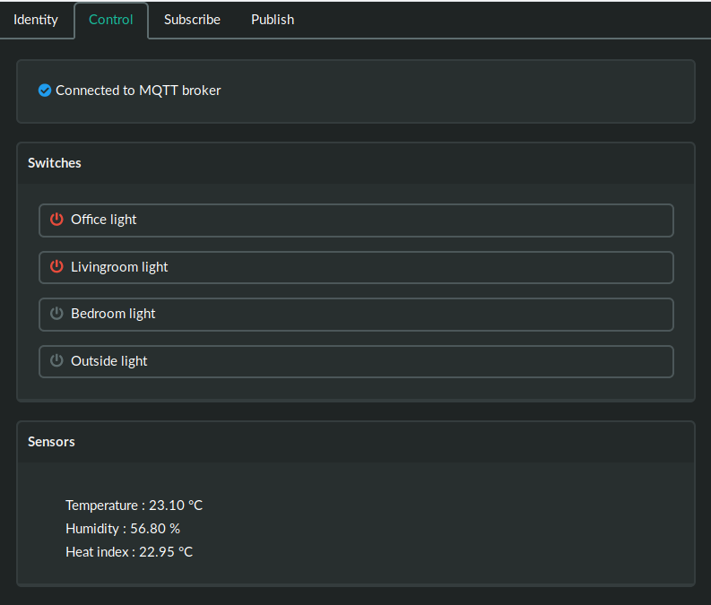

# MQTT Control Panel

Otto is a simple web application to control switches and view sensor output using MQTT over websockets. Connection settings are configured through the web interface, and stored in the browser's [local storage](https://developer.mozilla.org/en-US/docs/Web/API/Web_Storage_API).

There are also features for more general publish/subscribe of MQTT topics.

## Device Configuration and Messages

The interface reads [discovery](https://www.home-assistant.io/docs/mqtt/discovery/) messages from the MQTT broker and uses these to configure what devices to display and control.

For example, suppose we configure otto to use a "discover prefix" of "homeassistant", and we publish a retained message like this:

* topic: `homeassistant/switch/sprinkler/config`
* payload: `{"name": "Sprinkler system", "state_topic": "homeassistant/switch/sprinkler/state", "command_topic": "homeassistant/switch/sprinkler/set"}`

Clicking on the web interface button to turn the sprinkler on will send a message on topic `homeassistant/switch/sprinkler/set` with a payload of `ON`

Once the sprinkler has been turned on, whatever is controlling it is expected to set `homeassistant/switch/sprinkler/state` to `ON` and set the retain flag on that messag

Likewise for turning our example sprinkler off.

Use of "set" and "state" messages is compatible with what [Home Assistant](https://www.home-assistant.io/components/switch.mqtt/) expects.
