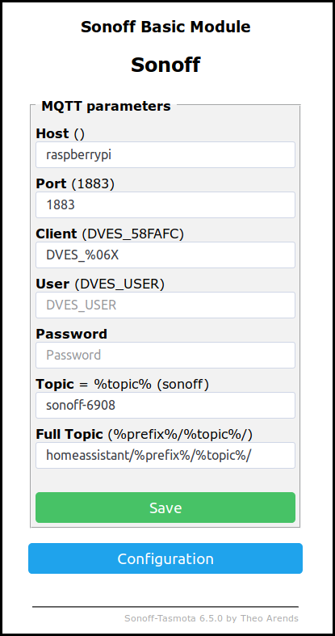
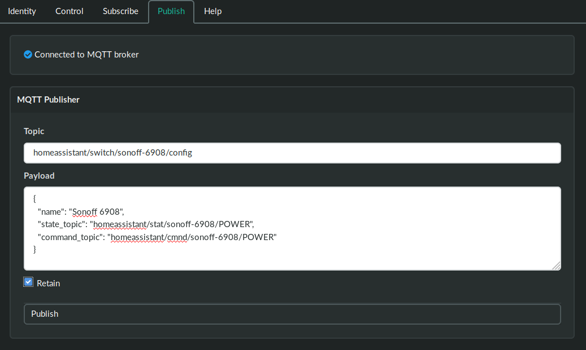

+++
title = "Using Tasmota Devices"
description = "Connecting Tasmota Devices"
+++

The [Tasmota](https://github.com/arendst/Sonoff-Tasmota/wiki) project provides open source hardware for a number of devices. Once you have a Tasmota device up and running on your WiFI network it can be set up to run with ʘttʘ:

#### Set up MQTT

From the device's web page, set up MQTT host and user credentials for your MQTT server

Also set the MQTT topic name and full topic.

The topic name should start with the "Discovery Prefix" that's configured in ʘttʘ, followed by a unique name. For example, for a "Discover Prefix" in ʘttʘ of "homeassistant", an MQTT topic name might be homeassistant/sonoff1

The full topic should be `%topic%/%prefix%/`




#### Retained Messages

ʘttʘ uses retained messages to check the state of devices. Go into the console screen on the device's website, type in `PowerRetain 1`, then press Enter


#### Create a Config Message for ʘttʘ

ʘttʘ populates its control panel by reading retained configuration messages. We can tell ʘttʘ all about this device by publishing a message.

For example, suppose we're using a "Discovery Prefix" in ʘttʘ of "homeassistant" and the MQTT Topic name configured in the device is "homeassistant/sonoff1", then we should publish a message like this:


Topic: __homeassistant/switch/sonoff1/config__

Payload (change the state and command topic prefixes as appropriate):

```
{  
  "name": "Sonoff 1",
  "state_topic": "homeassistant/sonoff1/stat/POWER",
  "command_topic": "homeassistant/sonoff1/cmnd/POWER"
}
```
__Retain__ should set to true


ʘttʘ's "Publish" panel can be used to publish this message, like this:




#### Testing it out

Refresh the ʘttʘ website and you should now see the device show up in ʘttʘ's "Contol" panel, all ready to use.
